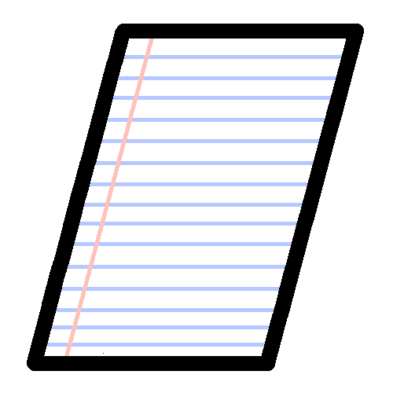

# JJakk
Hi, I'm JJakk, a software engineer primarily focused on front-end web development, and mobile app development.  I work almost exclusively in Javascript, and am proficient in Nodejs, Express, and React.  I'm also the creator of Jak Inventions, a github organization focused around developing minimalist Open-Source software
## Some of My Projects
### Brick Drop
A minimalist hyper-casual game

 
### ComClicker
A communal clicker game

 
### FreeXT
An open-source notes app

